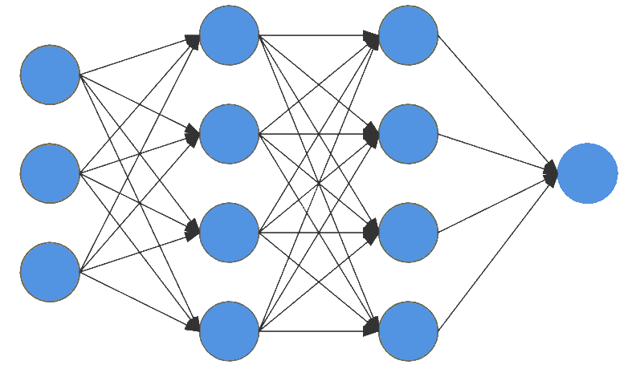

# NeuralNetwork

This is a object oriented neural network where each `Layer` has a n-amount of `Neurons` and each `Neuron` is capable of having it's own activation function. The structure of the `Neurons` and their connections to other `Layers` doesn't sepperate itself from other neural networks where each `Neuron` is connected to each `Neuron` in the next `Layer`

<div
 align="center">
    
</div>

## Create a neural network

You can either create a neural network with a single activation function for each `Neuron` which also indexes the `Neurons` automatically

```java
    NeuralNetwork network = new NeuralNetwork(FunctionType.SIGMOID, 2, 3, 1);
```

Alternatively, you can create each `Layer` individually which also requires each `Neuron` to be created individually with its own index and activation function

```java
    NeuralNetwork network = new NeuralNetwork(
        new Layer(
            new Neuron(FunctionType.SIGMOID, 0),
            new Neuron(FunctionType.SIGMOID, 1)
        ), new Layer(
            new Neuron(FunctionType.SIGMOID, 0),
            new Neuron(FunctionType.SIGMOID, 1),
            new Neuron(FunctionType.SIGMOID, 2)
        ), new Layer(
            new Neuron(FunctionType.SIGMOID, 0)
        )
    );
```

## Train a neural network

To train your neural network you can use either `DataSets` or normal `double` arrays. The advantage of `DataSets` is that they can be saved and loaded from
file

```java
    NeuralNetwork network = new NeuralNetwork(FunctionType.SIGMOID, 2, 3, 1);

    DataSet dataSet = new DataSet(
            new DataRow(new double[]{1, 0}, new double[]{1}),
            new DataRow(new double[]{1, 1}, new double[]{1}),
            new DataRow(new double[]{0, 1}, new double[]{1}),
            new DataRow(new double[]{0, 0}, new double[]{0})
    );

    /* TRAIN ON THE DATASET FOR 1000 CICLES */
    network.train(dataSet, 1000, .03);
```

## Serialize a neural network

<br />

```java
    NeuralNetwork network = new NeuralNetwork(FunctionType.SIGMOID, 2, 3, 1);
    network.save("Network");
    NeuralNetwork other = new NeuralNetwork().load("Network");
```